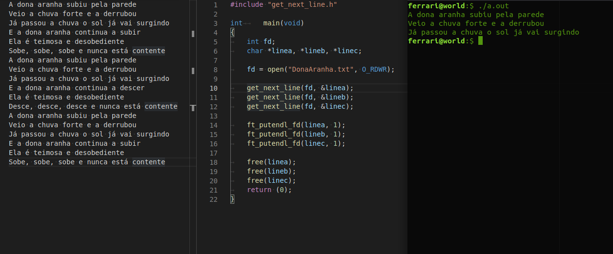
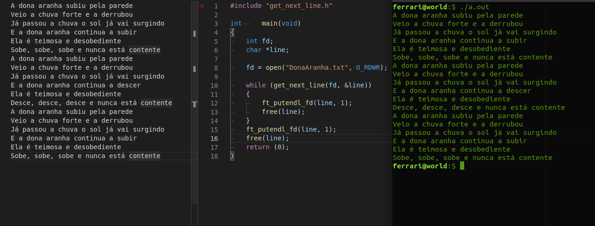

# GET_NEXT_LINE

Esta eh uma funcao que tem como objetivo devolver uma linha allocada de um **file descriptor** no buffer **line**, e vai avancando para a proxima linha conforme a funcao eh chamada, ate o final do arquivo.

## Como usar

**compile exemple**
```sh
gcc main.c -D BUFFER_SIZE=30 get_next_line.c libft.a
```
#### Exemplo 1

De a ela um ponteiro vazio do tipo string, e um index para um filedescriptor. Caso voce queira pega um arquivo de fora voce pode usar a funcao **open** para retornar o index **fd** do arquivo.  

  

#### Exemplo 2

Voce tambem pode printar o arquivo inteiro ate fim.

  

## Source code

#### libft - functions

[ft_strdup](https://github.com/LuigiEnzoFerrari/42School_Libft/blob/main/string/ft_strdup.c "ft_strdup")
[ft_rejoin](https://github.com/LuigiEnzoFerrari/42School_Libft/blob/main/string/ft_rejoin.c "ft_rejoin")
[ft_strchr](https://github.com/LuigiEnzoFerrari/42School_Libft/blob/main/string/ft_strchr.c "ft_strchr")
[ft_substr](https://github.com/LuigiEnzoFerrari/42School_Libft/blob/main/string/ft_substr.c "ft_substr")
[ft_strclen](https://github.com/LuigiEnzoFerrari/42School_Libft/blob/main/string/ft_strclen.c "ft_strclen")

```c
#include "get_next_line.h"

static int	last_returns(int n, char **save, char **line)
{
	char	*temp;

	if (n < 0)
		return (-1);
	*line = ft_substr(*save, 0, ft_strclen(*save, '\n'));
	if (!line)
		return (-1);
	if (ft_strchr(*save, '\n'))
	{
		temp = ft_strdup(ft_strchr(*save, '\n') + 1);
		free(*save);
		*save = temp;
		return (1);
	}
	free(*save);
	*save = NULL;
	return (0);
}

int	get_next_line(int fd, char **line)
{
	static char	*save[RLIMIT_NOFILE];
	char		*buffer;
	int			nbytes;

	if (BUFFER_SIZE <= 0 || fd < 0 || fd > RLIMIT_NOFILE || !line)
		return (-1);
	if (!save[fd])
		save[fd] = ft_strdup("");
	if (!save[fd])
		return (-1);
	buffer = (char *)malloc(sizeof(char) * (BUFFER_SIZE + 1));
	if (!buffer)
		return (-1);
	nbytes = read(fd, buffer, BUFFER_SIZE);
	while (nbytes > 0)
	{
		buffer[nbytes] = '\0';
		save[fd] = ft_rejoin(save[fd], buffer);
		if (ft_strchr(save[fd], '\n'))
			break ;
		nbytes = read(fd, buffer, BUFFER_SIZE);
	}
	free(buffer);
	return (last_returns(nbytes, &save[fd], line));
}
```
